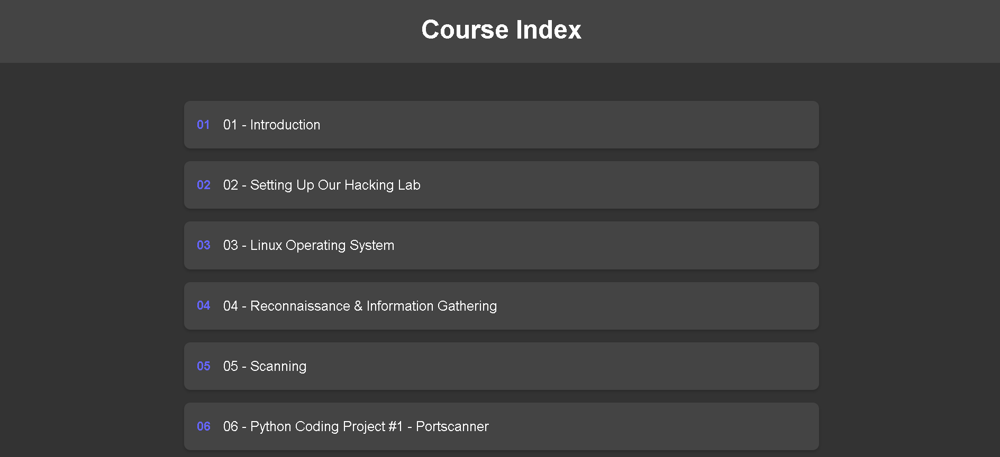
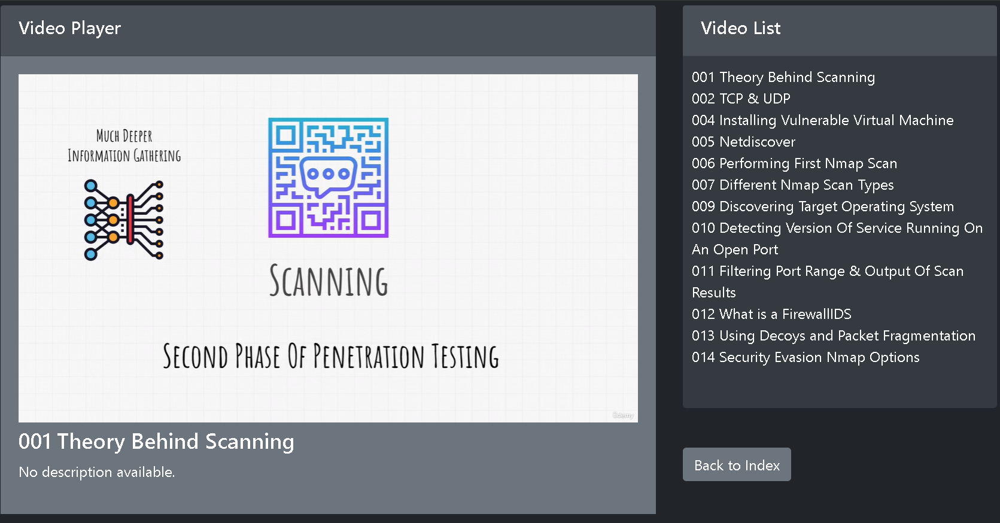

# CourseWebViewer

**CourseWebViewer** is a Flask-based web application designed to help you organize and view offline downloaded educational courses. This tool is particularly useful for managing Udemy courses or other course materials that you have downloaded and organized in a file structure.

## Screenshots

### Index Page


### App View


## Features

- **Browse Course Folders:** Navigate through your course folders sorted numerically.
- **View Videos:** Play videos directly from your browser with descriptions.
- **Access Resources:** Download associated resources like PDFs and text files.
- **Clean and Modern UI:** A user-friendly interface with a dark theme and Bootstrap styling.

## Getting Started

### Prerequisites

- Python 3.6 or higher
- Flask library

### Installation

1. **Clone the Repository:**

   ```bash
   git clone https://github.com/yourusername/yourrepository.git
   cd yourrepository
   python app.py
    ```
### Installation

1. **Install Dependencies:**

   Ensure Flask is installed in your environment. You can add Flask to your project dependencies if it's not already included.

2. **Configure the Base Directory:**

   Create a file named `putyourfolderpath.txt` in the project directory and add the absolute path to the directory containing your course files.

3. **Run the Application:**

   Start the Flask server by executing the `app.py` script.

4. **Access the Web Application:**

   Open your browser and navigate to `http://127.0.0.1:5000/` to start using the application.

 
